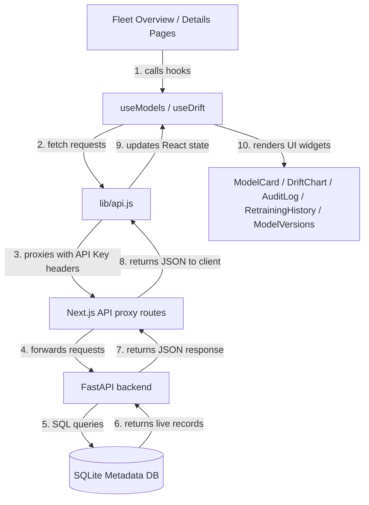

# Live Data Integration Report

This report documents the migration of the DriftGuard Dashboard to a strict **Live Data Only** architecture. All mock/demo/fallback models, simulated metrics, and hardcoded arrays have been purged from both the backend API and client components.

---

## 1. Mock Sources Removed & Purged

### A. Database Purge
* **Seeded Model (`fraud-detector-v1`)**: Executed a direct database query on the SQLite metadata file `driftguard_metadata.db` to delete the seeded `fraud-detector-v1` model and its related records across all projects. This prevents duplication and makes the fleet dashboard display only authentic models registered via the SDK or REST API.

### B. FastAPI Backend Fallbacks Removed
* **Fleet Observability (`list_models`)**: Removed the auto-seeding logic in the `/models` endpoint that created a fake `fraud-detector-v1` model in the DB when no models were registered for the current user. It now returns `[]` (an empty array) when empty.
* **Drift Score Telemetry (`get_drift_metrics`)**: Removed the dynamic mock prediction log generator in `/drift/{model_id}`. It now returns `[]` when no prediction telemetry exists.
* **Retraining Timeline (`get_retraining_history`)**: Removed the seed retraining event fallback in `/retraining/history/{model_id}`. It now returns `[]` when empty.
* **Governance Audit Logs (`get_audit_logs`)**: Removed the seed audit log fallback in `/audit/{model_id}`. It now returns `[]` when empty.

### C. Client UI Cleanups
* **Login page (`pages/login.js`)**: Removed the **Explore with Demo Mode** button to prevent entering the application with a local `"demo-key"`, enforcing database-authenticated API key logins.
* **Duplicate Route Deletion (`pages/api/retraining.js`)**: Deleted the duplicate retraining timeline proxy route which had mock fallback constants.
* **Timeline Metrics (`components/RetrainingHistory.js`)**: Updated `renderAccuracyChange` to render accuracy indicators only if actual performance records exist in the database (removing mock defaults like `0.85` or version `1.0.0`).
* **Model Cards (`components/ModelCard.js`)**: Updated `accuracyVal` and `formattedAccuracy` to display direct values or empty indicators (`"—"`) instead of fabricating a default `0.85` (85.00%) accuracy.

---

## 2. Files Modified

| Component | File Path | Action | Description |
|---|---|---|---|
| **Backend API** | [main.py](file:///c:/Users/Yugendra/Downloads/MLopsProject/main.py) | `MODIFY` | Removed all mock fallback/seeding loops from `/models`, `/drift`, `/audit`, and `/retraining/history` endpoints. |
| **Login Screen** | [login.js](file:///c:/Users/Yugendra/Downloads/MLopsProject/dashboard/pages/login.js) | `MODIFY` | Removed "Explore with Demo Mode" option. |
| **Timeline** | [RetrainingHistory.js](file:///c:/Users/Yugendra/Downloads/MLopsProject/dashboard/components/RetrainingHistory.js) | `MODIFY` | Prevented mock accuracy indicators. |
| **Model Cards** | [ModelCard.js](file:///c:/Users/Yugendra/Downloads/MLopsProject/dashboard/components/ModelCard.js) | `MODIFY` | Removed default 85% accuracy fallback. |
| **Proxy API** | [retraining.js](file:///c:/Users/Yugendra/Downloads/MLopsProject/dashboard/pages/api/retraining.js) | `DELETE` | Deleted duplicate, mock-fallback proxy handler. |

---

## 3. Live Data Flow Architecture

With the mock layers eliminated, the backend database acts as the single source of truth for the entire dashboard:

Every metric, timeline entry, status badge, and version on the dashboard is now computed exclusively from live data recorded in the database.
