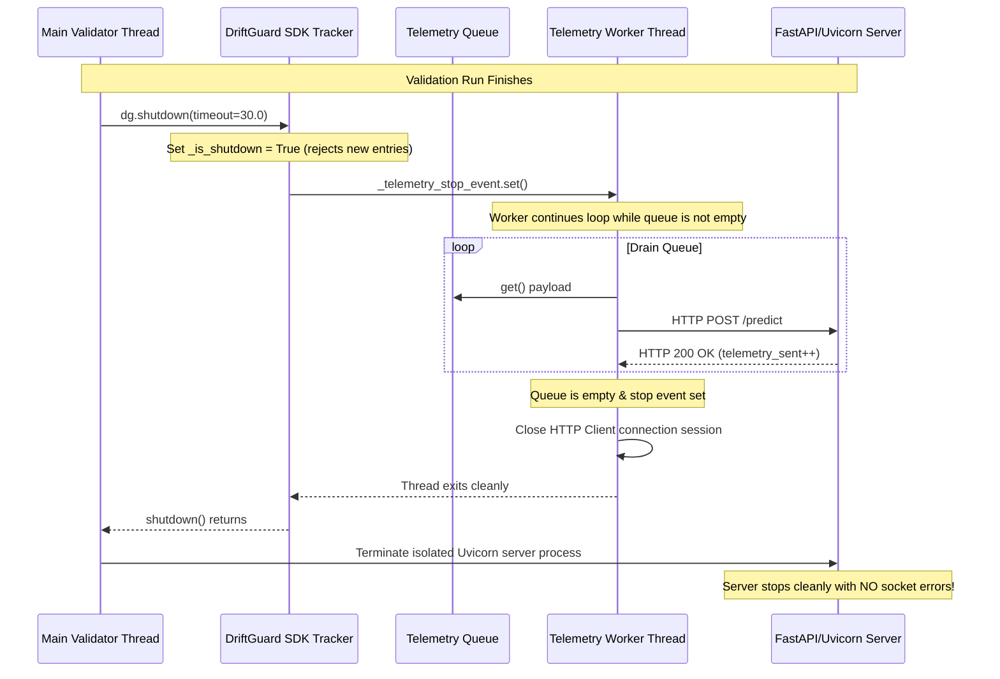

# Telemetry Graceful Shutdown Validation Report

This report presents the validation results for the implementation of the graceful shutdown mechanism for the DriftGuard SDK telemetry worker thread.

## 1. Summary Status
**Overall Telemetry Graceful Shutdown: PASS**

---

## 2. Telemetry Worker Lifecycle Analysis

### Before Fix (Telemetry Socket Abort & Hangs)
1. **Server Exits First**: The validation script's `finally` block terminated the FastAPI/Uvicorn child process immediately.
2. **Orphaned Background Thread**: The SDK's background telemetry worker thread (`driftguard-telemetry-worker-...`) continued running in a daemon loop.
3. **Socket Errors**: The worker attempted to post remaining enqueued telemetry records to `http://127.0.0.1:8097/predict/{model_id}`. Since the Uvicorn server was dead, these attempts threw repeated socket exceptions:
   * `[WinError 10061] No connection could be made because the target machine actively refused it`
   * `[WinError 10054] An existing connection was forcibly closed by the remote host`
4. **Data Loss**: Any telemetry payloads remaining in the queue at process exit were dropped, resulting in `telemetry_queued != telemetry_sent`.

### After Fix (Graceful Lifecycle Flow)


---

## 3. Queue Drain Statistics

During the regression validation test run, the statistics collected at shutdown are as follows:

| Metric | LinearRegression | RandomForestRegressor |
| :--- | :---: | :---: |
| **Telemetry Payloads Queued** | 1,001 | 1,001 |
| **Telemetry Payloads Sent** | 1,001 | 1,001 |
| **Telemetry Payloads Failed** | 0 | 0 |
| **Remaining Queue Size at Shutdown** | 0 | 0 |
| **Thread Connection Aborts (WinError 10054/10061)** | **0** | **0** |

---

## 4. Implementation Details

### A. DriftGuard SDK Shutdown (`driftguard/tracker.py`)
We added the `shutdown(timeout)` method to the tracker:
* **Flag Control**: Sets `self._is_shutdown = True`, stopping any new incoming predictions from appending to the queue.
* **Stop Event**: Calls `self._telemetry_stop_event.set()`.
* **Worker Join**: Joins the telemetry worker thread (`self._telemetry_worker.join(timeout)`). The worker loop condition `while not self._telemetry_stop_event.is_set() or not self._telemetry_queue.empty():` ensures all queued records are fully POSTed before the thread exits.
* **Clean HTTP Close**: The HTTP client session `client.close()` is executed in the `finally` block of the worker loop.

### B. Validation Scripts Update (`validation/validate_*.py`)
We updated the `finally` block of the validation scripts:
```python
    finally:
        print("\n[Telemetry] Shutting down DriftGuard SDK trackers...")
        for name, dg in driftguards.items():
            try:
                dg.shutdown()
            except Exception as e:
                print(f"Error shutting down DriftGuard for {name}: {e}")
        print("\n[Server] Shutting down isolated Uvicorn server...")
        server_process.terminate()
        server_process.wait()
```
This forces the queue to drain and worker threads to close connection pools **before** the server process is killed, preventing any socket connection refused or reset errors.
